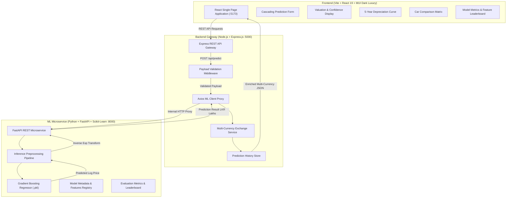

# 🚗 Enterprise Used Car Price Valuation & Market Intelligence Platform

An end-to-end, production-grade Machine Learning and Web Application system designed specifically for the **Sri Lankan Automobile Market**. Built for the **GDSE Machine Learning Module Assignment**, this platform bridges advanced machine learning regression techniques with a high-performance modern 3-tier microservices architecture.

---

## 🌟 Key Features

- **Accurate Real-time Valuation**: Instant market price estimation based on vehicle brand, model, edition, transmission, mileage, engine capacity, condition, and luxury options.
- **7 Advanced Feature Engineering Pipelines**: Robust data preprocessing, IQR outlier clipping, log-transformed target modeling ($\log(1 + y)$), frequency encoding, and luxury scoring.
- **5-Model Benchmark Suite**: Rigorous evaluation across Linear Regression, Ridge, Decision Tree, Random Forest, and Gradient Boosting with 5-fold Cross-Validation.
- **Interactive 5-Year Depreciation Forecasting**: Dynamic residual value curve forecasting vehicle depreciation over 5 years.
- **Multi-Currency Conversion Engine**: Real-time price conversion across LKR (Lakhs & Total), USD, EUR, GBP, and JPY.
- **Side-by-Side Car Comparison**: Compare two car configurations simultaneously to evaluate valuation and value-retention.
- **Analytics & Model Leaderboard**: Real-time inspection of ML model performance metrics ($R^2$, RMSE, MAE, MAPE) and top feature importances.
- **Historical Prediction Log**: Persistent, searchable history drawer with instant re-calculation.

---

## 🏛️ System Architecture

The platform is architected as an enterprise 3-tier microservices system:



---

## 📊 ML Model Performance & Leaderboard

The models were evaluated on 9,770 cleaned Sri Lankan vehicle records using 5-Fold Cross-Validation and a held-out test split (80/20):

| Model | 5-Fold CV $R^2$ | Test $R^2$ | Test RMSE (Lakhs) | Test MAE (Lakhs) | Test MAPE (%) | Training Time |
| :--- | :---: | :---: | :---: | :---: | :---: | :---: |
| **Gradient Boosting** ⭐ | **0.9063 ± 0.005** | **0.7001** | **26.69** | **7.90** | **14.75%** | 39.41s |
| **Random Forest** | 0.9026 ± 0.004 | 0.6908 | 27.10 | 7.14 | **13.85%** | 4.78s |
| **Decision Tree** | 0.8619 ± 0.006 | 0.6782 | 27.65 | 8.09 | 16.81% | 0.33s |
| **Linear Regression** | 0.8742 ± 0.009 | 0.5588 | 32.37 | 9.60 | 18.49% | 1.11s |
| **Ridge Regression** | 0.8739 ± 0.009 | 0.5583 | 32.39 | 9.61 | 18.48% | 1.25s |

> **Selected Champion Model**: **Gradient Boosting Regressor** (`car_price_model.pkl`), achieving the lowest RMSE of **26.69 Lakhs** and highest Cross-Validation $R^2$ of **0.9063**.

---

## 🛠️ Technology Stack

| Layer | Technologies |
| :--- | :--- |
| **ML Microservice** | Python 3.10+, FastAPI, Uvicorn, Scikit-Learn, Pandas, NumPy, Joblib |
| **Backend Gateway** | Node.js, Express.js, Axios, CORS, Dotenv |
| **Frontend Client** | React 19, Vite, Material UI (MUI v6), Lucide Icons, Custom SVG Visualizations |
| **Architecture** | Microservices REST API, 3-Tier Separation of Concerns |

---

## 🚀 Quick Start & Installation

### Prerequisites
- **Python 3.10+**
- **Node.js 18+** and **npm**
- **Git**

---

### 1. Clone the Repository
```bash
git clone https://github.com/ruwani425/used-car-price-predictor.git
cd used-car-price-predictor
```

---

### 2. Run ML Microservice (`ml-service/`)
```bash
cd ml-service
# Create and activate virtual environment
python -m venv venv
# On Windows PowerShell:
.\venv\Scripts\Activate.ps1
# On Linux/macOS:
# source venv/bin/activate

# Install dependencies
pip install -r requirements.txt

# (Optional) Retrain models & regenerate artifacts
python clean_dataset.py
python feature_engineering.py
python train.py

# Start FastAPI server on port 8000
uvicorn app:app --host 127.0.0.1 --port 8000 --reload
```
- **ML Swagger Docs**: [http://localhost:8000/docs](http://localhost:8000/docs)
- **Health Check**: [http://localhost:8000/health](http://localhost:8000/health)

---

### 3. Run Backend API Gateway (`backend/`)
```bash
cd ../backend
npm install
npm run dev
```
- **Gateway Endpoint**: [http://localhost:5000](http://localhost:5000)
- **Health Endpoint**: [http://localhost:5000/health](http://localhost:5000/health)

---

### 4. Run Frontend Application (`frontend/`)
```bash
cd ../frontend
npm install
npm run dev
```
- **Web App URL**: [http://localhost:5173](http://localhost:5173)

---

## 📡 REST API Documentation

### 1. Predict Car Valuation
- **Endpoint**: `POST /api/predict`
- **Headers**: `Content-Type: application/json`
- **Request Body**:
```json
{
  "brand": "TOYOTA",
  "model": "PREMIO",
  "model_year": 2018,
  "transmission": "Automatic",
  "mileage_km": 45000,
  "engine_capacity": 1500,
  "fuel_type": "Petrol",
  "vehicle_condition": "Used",
  "town": "Colombo",
  "options": {
    "air_conditioning": true,
    "power_steering": true,
    "power_window": true,
    "power_mirror": true,
    "has_ongoing_lease": false
  }
}
```
- **Response (200 OK)**:
```json
{
  "success": true,
  "prediction": {
    "price_lkr_lakhs": 142.50,
    "price_lkr_total": 14250000,
    "confidence_interval": {
      "lower_lakhs": 128.25,
      "upper_lakhs": 156.75,
      "lower_total": 12825000,
      "upper_total": 15675000
    },
    "converted_prices": {
      "USD": { "amount": 46644.84, "symbol": "$", "formatted": "$46,645" },
      "EUR": { "amount": 42818.51, "symbol": "€", "formatted": "€42,819" },
      "GBP": { "amount": 35948.54, "symbol": "£", "formatted": "£35,949" },
      "JPY": { "amount": 6951219.51, "symbol": "¥", "formatted": "¥6,951,220" }
    },
    "depreciation_forecast": [
      { "year_offset": 0, "year": 2026, "estimated_price_lakhs": 142.50, "retained_percentage": 100 },
      { "year_offset": 1, "year": 2027, "estimated_price_lakhs": 131.10, "retained_percentage": 92.0 },
      { "year_offset": 2, "year": 2028, "estimated_price_lakhs": 120.61, "retained_percentage": 84.6 },
      { "year_offset": 3, "year": 2029, "estimated_price_lakhs": 110.96, "retained_percentage": 77.9 },
      { "year_offset": 4, "year": 2030, "estimated_price_lakhs": 102.09, "retained_percentage": 71.6 },
      { "year_offset": 5, "year": 2031, "estimated_price_lakhs": 93.92, "retained_percentage": 65.9 }
    ]
  }
}
```

---

## 👥 Team & Work Distribution

| Member | Student Name | Student ID | Batch | Role & Key Contributions |
| :--- | :--- | :---: | :---: | :--- |
| **Member 01** | **W. Himadi Yenushka De Silva** | `241711081` | GDSE 71 | **ML & Fullstack Integration**: Data Cleaning, 7 Feature Engineering Pipelines, FastAPI Microservice, Multi-Currency Engine, Result Visualizations & Depreciation Charts, E2E Integration Suite. |
| **Member 02** | **E.V. Ruwani Ranthika** | `241722021` | GDSE 72 | **ML Benchmarking & Frontend**: Multi-Model Benchmarking & Tuning, Model Serialization, Express REST API Gateway, Luxury Dark Theme, Cascading Valuation Form, Analytics Leaderboard & Car Comparison. |

---

## 📄 License & Academic Integrity

Developed for the **Graduate Diploma in Software Engineering (GDSE)** Machine Learning Module. All rights reserved.
