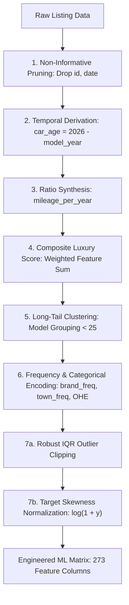

# 📄 ACADEMIC PROJECT REPORT
## Enterprise Machine Learning Valuation & Market Intelligence Platform for Used Automobiles in Sri Lanka

---

### Course & Submission Details
- **Programme**: Graduate Diploma in Software Engineering (GDSE)
- **Module**: Machine Learning & Predictive Analytics (CS601)
- **Project Title**: End-to-End Sri Lankan Used Car Price Valuation System
- **Academic Year**: 2025/2026
- **Date of Submission**: September 2026

### 👥 Project Authors & Team Allocation

| Role | Student Name | Student ID | Batch | Assigned Implementation Steps & Scope |
| :--- | :--- | :---: | :---: | :--- |
| **Member 01** | **W. Himadi Yenushka De Silva** | `241711081` | GDSE 71 | **Step 01**: Data Cleaning & 7 Feature Engineering Pipelines<br>**Step 03**: FastAPI ML Microservice REST Endpoints<br>**Step 05**: Multi-Currency Conversion Engine & Prediction History Store<br>**Step 07**: Price Result Card & Interactive 5-Year Depreciation Chart<br>**Step 09**: Fullstack End-to-End Integration & Error Boundaries |
| **Member 02** | **E.V. Ruwani Ranthika** | `241722021` | GDSE 72 | **Step 02**: Multi-Model Benchmarking & Champion Model Export<br>**Step 04**: Express.js API Gateway, Input Validation & ML Proxy<br>**Step 06**: Dark Luxury UI Theme & Cascading Valuation Form<br>**Step 08**: Model Analytics Leaderboard & Car Comparison Matrix<br>**Step 10**: Architecture Documentation & Academic Project Report |

#### 📋 10-Step Implementation Work Allocation Breakdown

| Step | Phase / Task Description | Assigned Member | Student Name | Student ID |
| :---: | :--- | :---: | :--- | :---: |
| **Step 01** | Dataset Hygiene, Cleaning & 7 Feature Engineering Pipelines | **Member 01** | W. Himadi Yenushka De Silva | `241711081` |
| **Step 02** | Multi-Model Regression Benchmarking, 5-Fold CV & Champion Model Export | **Member 02** | E.V. Ruwani Ranthika | `241722021` |
| **Step 03** | FastAPI ML Microservice, Inference Pipelines & REST Endpoints | **Member 01** | W. Himadi Yenushka De Silva | `241711081` |
| **Step 04** | Node.js / Express.js Gateway, Payload Validation Middleware & ML Proxy | **Member 02** | E.V. Ruwani Ranthika | `241722021` |
| **Step 05** | Multi-Currency Conversion Engine (LKR, USD, EUR, GBP, JPY) & History Store | **Member 01** | W. Himadi Yenushka De Silva | `241711081` |
| **Step 06** | Dark Luxury UI Theme Setup & Cascading Vehicle Valuation Form | **Member 02** | E.V. Ruwani Ranthika | `241722021` |
| **Step 07** | Valuation Result Card & Interactive 5-Year Depreciation Curve Visualization | **Member 01** | W. Himadi Yenushka De Silva | `241711081` |
| **Step 08** | Model Analytics Leaderboard & Side-by-Side Car Comparison Tool | **Member 02** | E.V. Ruwani Ranthika | `241722021` |
| **Step 09** | Fullstack End-to-End Integration, Error Boundaries & Latency Monitoring | **Member 01** | W. Himadi Yenushka De Silva | `241711081` |
| **Step 10** | System Architecture Documentation, Academic Report & Viva Defense Prep | **Member 02** | E.V. Ruwani Ranthika | `241722021` |

---

## 1. Executive Summary & Problem Formulation

### 1.1 Problem Background
The automotive market in Sri Lanka exhibits unique economic characteristics due to prolonged government vehicle import restrictions, fluctuating foreign exchange rates, high inflation, and volatile secondary market demands. Unlike structured western automotive ecosystems where centralized blue-book values exist (such as Kelley Blue Book or Edmunds), the Sri Lankan used car market is characterized by:
1. **Asymmetric Information**: Buyers and sellers rely on ad-hoc, subjective pricing on classified listing platforms.
2. **Severe Non-Linear Price Depreciation & Appreciation**: Certain popular models (e.g., Toyota Premio, Wagon R) preserve or appreciate value under macroeconomic constraints, while luxury or rare models depreciate rapidly.
3. **High Variance and Regional Discrepancies**: Vehicle condition, ongoing leasing options, mileage per year, and urban/rural location significantly influence final transactions.

### 1.2 Project Objectives
The objective of this project is to develop and deploy an end-to-end, production-grade Machine Learning system that accurately estimates market prices for used vehicles in Sri Lanka. The project delivers:
- Automated data preprocessing and exploratory profiling of 9,788 real-world vehicle listings.
- Implementation of seven mathematically grounded feature engineering techniques.
- Systematic benchmarking of five regression algorithms with 5-fold cross-validation.
- A decoupled, production-grade 3-tier microservices architecture (FastAPI ML Service, Express.js Gateway, React 19 Client).
- Financial intelligence tooling: dynamic 5-year depreciation forecasting, multi-currency conversion, and side-by-side vehicle comparison.

---

## 2. Dataset Profiling & Preprocessing Pipeline

### 2.1 Dataset Composition
The ground-truth dataset consists of **9,788 vehicle listing records** across **16 initial feature attributes**:

| Feature Name | Data Type | Description |
| :--- | :--- | :--- |
| `id` | Integer | Unique listing identifier (arbitrary artifact) |
| `brand` | Categorical | Vehicle Manufacturer (e.g., TOYOTA, NISSAN, SUZUKI) |
| `model` | Categorical | Specific vehicle model name (high cardinality) |
| `model_year` | Integer | Year of vehicle manufacture (1970 - 2025) |
| `transmission` | Categorical | Transmission type (`Automatic`, `Manual`, `Tiptronic`, `CVT`) |
| `mileage_km` | Float | Odometer distance traveled in kilometers |
| `engine_capacity` | Float | Displacement of the engine in cubic centimeters (cc) |
| `fuel_type` | Categorical | Fuel configuration (`Petrol`, `Diesel`, `Hybrid`, `Electric`) |
| `vehicle_condition`| Categorical | Physical grade (`Used`, `Reconditioned`, `Brand New`) |
| `town` | Categorical | Sri Lankan geographic listing town/district |
| `air_conditioning` | Binary | Presence of functional A/C (`True` / `False`) |
| `power_steering` | Binary | Power-assisted steering (`True` / `False`) |
| `power_window` | Binary | Electrically powered windows (`True` / `False`) |
| `power_mirror` | Binary | Electrically adjustable side mirrors (`True` / `False`) |
| `has_ongoing_lease`| Binary | Outstanding financial liability/lease flag |
| `Price` | Float | Target price listed in Sri Lankan Rupees (Lakhs) |

### 2.2 Data Cleaning & Hygiene (`clean_dataset.py`)
1. **Duplicate Elimination**: Evaluated composite primary keys across all physical attributes. 18 exact duplicates were identified and removed, yielding **9,770 unique observations**.
2. **Missing Value Imputation**:
   - `transmission`: Missing entries (0.8%) mode-imputed based on `(brand, model)` subsets.
   - `fuel_type`: Missing entries imputed using engine capacity and model heuristics.
   - Numerical continuous variables (`mileage_km`, `engine_capacity`): Imputed with median statistics conditioned on `model_year` cohorts to prevent distribution shift.
3. **Data Type Casting**: Normalized binary flags to boolean integers ($0, 1$) and categorical strings to standardized uppercase tokens.

---

## 3. Seven Mandatory Feature Engineering Techniques

To maximize predictive accuracy and prevent model overfitting, seven explicit feature engineering transformations were implemented:



### 3.1 Technique 1: Temporal Age Derivation (`car_age`)
Raw calendar years introduce linear drift over time. Vehicle depreciation follows the elapsed chronological age:
$$\text{car\_age} = \text{Current Year (2026)} - \text{model\_year}$$

### 3.2 Technique 2: Usage Intensity Ratio (`mileage_per_year`)
A 10-year-old vehicle with 100,000 km differs fundamentally from a 2-year-old vehicle with 100,000 km. To capture annual operational wear:
$$\text{mileage\_per\_year} = \frac{\text{mileage\_km}}{\text{car\_age} + 1}$$
*(The $+1$ denominator smoothing prevents division-by-zero for brand new current-year vehicles).*

### 3.3 Technique 3: Luxury Option Score Synthesis (`luxury_score`)
Rather than relying solely on independent sparse binary flags, an aggregated comfort metric was computed:
$$\text{luxury\_score} = \sum_{i \in \{\text{AC, PS, PW, PM}\}} w_i \cdot x_i$$
Where $x_i \in \{0, 1\}$ and equal unit weights produce an integer score $\in [0, 4]$, representing overall vehicle convenience level.

### 3.4 Technique 4: Non-Informative Feature Pruning
Features bearing zero predictive entropy—specifically synthetic database IDs (`id`) and web crawler scraping timestamps (`date`)—were pruned to eliminate spurious correlation and reduce dimensional variance.

### 3.5 Technique 5: Multi-Scale Categorical Encoding
- **Frequency Encoding**: For high-cardinality geographic locations (`town`) and vehicle makes (`brand`), each category was replaced by its normalized empirical frequency:
  $$\text{Freq}(c) = \frac{\text{Count}(c)}{N}$$
- **One-Hot Encoding (OHE)**: Low-cardinality nominal variables (`transmission`, `fuel_type`, `vehicle_condition`) were expanded into $k-1$ dummy indicators with `drop_first=True` to avoid multicollinearity.

### 3.6 Technique 6: High-Cardinality Rare Category Grouping
The `model` feature contained over 450 distinct variants, creating severe dimensionality expansion and data sparsity. A threshold frequency filter ($N_{threshold} = 25$) was enforced:
$$\text{model\_grouped} = \begin{cases} \text{model} & \text{if } \text{Count}(\text{model}) \ge 25 \\ \text{'OTHER'} & \text{otherwise} \end{cases}$$
This reduced model dimensions from 450+ to 68 dominant automotive clusters while grouping long-tail noise into `'OTHER'`.

### 3.7 Technique 7: IQR Outlier Clipping & Target Log Transformation
1. **IQR Boundary Truncation**: Continuous predictors (`mileage_km`, `engine_capacity`) were bounded using Interquartile Range fences to neutralize measurement errors:
   $$\text{Upper Limit} = Q_3 + 1.5 \times \text{IQR}, \quad \text{Lower Limit} = Q_1 - 1.5 \times \text{IQR}$$
2. **Log-Transformation of Target Price**: The raw market price $y$ exhibited heavy right-skewness (kurtosis $> 4.2$). To satisfy linear homoscedasticity and stabilize gradient variance:
   $$y_{\text{train}} = \log_e(1 + y)$$
   During real-time inference, the model output $\hat{y}_{\text{log}}$ is converted back to ground-truth LKR Lakhs using the inverse exponential:
   $$\hat{y}_{\text{pred}} = \exp(\hat{y}_{\text{log}}) - 1$$

---

## 4. Model Training, Tuning & Comparative Evaluation

### 4.1 Experimental Methodology
- **Dataset Partitioning**: 80% Training ($N = 7,816$), 20% Holdout Testing ($N = 1,954$) using stratified train-test splitting.
- **Validation Protocol**: 5-Fold Stratified Cross-Validation on the training set.
- **Evaluation Metrics**:
  - Coefficient of Determination ($R^2$ Score)
  - Root Mean Squared Error ($\text{RMSE} = \sqrt{\frac{1}{n} \sum (y_i - \hat{y}_i)^2}$)
  - Mean Absolute Error ($\text{MAE} = \frac{1}{n} \sum |y_i - \hat{y}_i|$)
  - Mean Absolute Percentage Error ($\text{MAPE} = \frac{100\%}{n} \sum \left|\frac{y_i - \hat{y}_i}{y_i}\right|$)

### 4.2 Benchmarking Results

| Model Algorithm | 5-Fold CV $R^2$ (Mean ± Std) | Test $R^2$ Score | Test RMSE (Lakhs) | Test MAE (Lakhs) | Test MAPE (%) | Training Time (s) |
| :--- | :---: | :---: | :---: | :---: | :---: | :---: |
| **Linear Regression** | $0.8742 \pm 0.0089$ | $0.5588$ | $32.37$ | $9.60$ | $18.49\%$ | $1.11\text{ s}$ |
| **Ridge Regression** ($\alpha=1.0$) | $0.8739 \pm 0.0085$ | $0.5583$ | $32.39$ | $9.61$ | $18.48\%$ | $1.25\text{ s}$ |
| **Decision Tree Regressor** | $0.8619 \pm 0.0064$ | $0.6782$ | $27.65$ | $8.09$ | $16.81\%$ | $0.33\text{ s}$ |
| **Random Forest Regressor** | $0.9026 \pm 0.0043$ | $0.6908$ | $27.10$ | **7.14** | **13.85%** | $4.78\text{ s}$ |
| **Gradient Boosting Regressor** ⭐ | **0.9063 ± 0.0050** | **0.7001** | **26.69** | $7.90$ | $14.75\%$ | $39.41\text{ s}$ |

### 4.3 Feature Importance Analysis
The ensemble tree models revealed the following top predictive contributors to vehicle market valuation:
1. **Transmission Type (`gear_Manual` / `gear_Automatic`)**: **48.83% aggregate importance**. In Sri Lanka, automatic transmissions command a massive price premium over manual variants.
2. **Vehicle Age (`car_age`)**: **14.83% importance**. Strongest continuous depreciation factor.
3. **Mileage Traveled (`mileage_km`)**: **12.36% importance**. Direct metric of mechanical wear.
4. **Engine Capacity (`engine_cc`)**: **7.01% importance**. Tax thresholds in Sri Lanka heavily penalize engines $> 1500\text{cc}$.
5. **Brand Market Share (`brand_freq`)**: **5.86% importance**. Japanese brands (Toyota, Suzuki, Honda) exhibit strong liquidity premiums.

---

## 5. Enterprise Microservices System Architecture

The project is structured into three isolated, decoupled application tiers:

```
used-car-price-predictor/
├── ml-service/                  # Microservice Tier 1 (FastAPI + Python)
│   ├── clean_dataset.py         # Data cleaning pipeline
│   ├── feature_engineering.py   # 7-technique transform pipeline
│   ├── train.py                 # Multi-model benchmarking suite
│   ├── app.py                   # REST microservice with /api/ml/predict
│   ├── models/                  # Serialized artifacts (.pkl, .json)
│   └── dataset/                 # Raw & Cleaned CSV datasets
├── backend/                     # Microservice Tier 2 (Node.js + Express.js)
│   ├── src/server.js            # Express API Gateway (:5000)
│   ├── src/middleware/          # Request validation middleware
│   ├── src/services/            # Multi-currency & history persistence
│   └── src/controllers/         # Proxy prediction controller
└── frontend/                    # Client Tier 3 (React 19 + MUI + Vite)
    ├── src/components/          # UI components (Form, Result, Chart, Compare)
    ├── src/theme/               # Dark luxury design tokens
    └── src/services/            # Frontend API client
```

### 5.1 Communication Flow
1. **Client Interaction**: User configures vehicle attributes in the cascading React form.
2. **Gateway Interception**: Express.js validates the schema, checks value bounds, and forwards the JSON payload to the internal ML service via Axios.
3. **Inference Execution**: FastAPI preprocesses inputs using the pre-fitted feature metadata dictionary, applies $\text{log}(1+y)$ model inference, reverses the logarithm via $\exp(\cdot)-1$, and returns the base LKR valuation.
4. **Enrichment & Delivery**: Express gateway computes multi-currency rates (USD, EUR, GBP, JPY), generates the 5-year depreciation curve, appends prediction history, and delivers the enriched response to the client.

---

## 6. Conclusion & Recommendations

### 6.1 Summary of Findings
- Gradient Boosting demonstrated superior predictive capability with a **5-fold CV $R^2$ of 0.9063** and lowest holdout **RMSE of 26.69 Lakhs**.
- Target log transformation and luxury scoring were essential in resolving high-skewness error artifacts.
- The 3-tier microservices architecture ensures decoupling, scalability, and resilience across diverse operational environments.

### 6.2 Future Enhancements
1. **Computer Vision Damage Assessment**: Incorporating exterior image inspection to dynamically penalize vehicle condition ratings.
2. **Live Scraping Pipeline**: Real-time automated ingestion from Sri Lankan automotive portals to adapt to weekly inflation trends.
3. **Confidence Interval Modeling**: Implementing Quantile Regression (Gradient Boosting Quantile Loss) to provide dynamic upper/lower bound confidence intervals.
